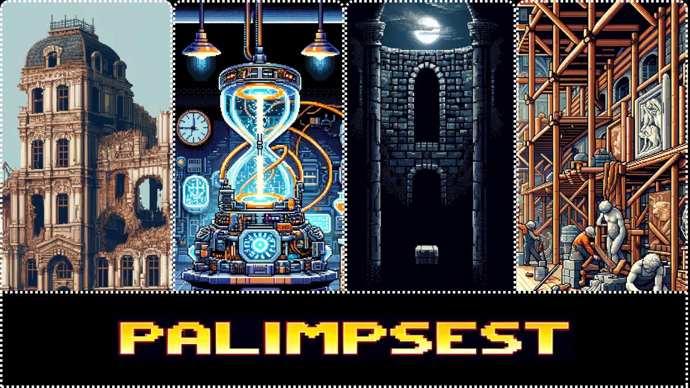

# PALIMPSEST

## Les temps de l'espace

L’espace est intimement lié à la construction des temporalités. Pour **Fernand Braudel** (1966), cet espace ne se limite pas uniquement à un cadre, mais influence et façonne les sociétés et leurs temporalités. **Hervé Théry** (1986) propose de reconstituer les processus historiques de l’environnement à travers le concept de *chronochorèmes*, à savoir les éléments du passé qui constituent l'espace actuel. Dans cette perspective, **Jean-Luc Piveteau** (1995) a noté avec pertinence que le paysage contemporain est un "*affleurement de multiples durées*". Ces quelques contributions renforcent l'idée que le paysage n'est pas une simple juxtaposition d'éléments, mais une surface où les différentes temporalités se manifestent de manière dynamique et parfois fragmentée.

---

L’analyse de l'espace, au travers des paysages qui l’ont représenté au cours du temps, permet de reconstituer des processus historiques et leur déroulement. Vu comme un *palimpseste*, ce paysage peut dès lors signifier qu'il est un entassement et un chevauchement d'éléments de différentes époques. Cette métaphore suggère que le paysage actuel est le résultat de multiples transformations et ajouts successifs à travers le temps (**François Walter** 2006). Ainsi, la notion de *palimpseste* invite à une lecture du paysage qui prend en compte sa profondeur temporelle.

---

En somme, l'espace n'est pas seulement un décor ou un cadre passif pour l'histoire ; il est un élément actif dans la construction des temporalités. Il est à la fois une métaphore, un facteur d'influence, et un objet d'étude qui permet de comprendre les différentes échelles de temps et leurs interactions.  

Le *palimpseste* appliqué au paysage souligne l'importance de considérer l'espace comme une archive temporelle où se superposent différentes temporalités. Le paysage n'est donc pas un simple décor, mais un témoin de l'histoire et des interactions complexes entre l'homme et son environnement.

---

## Plongez dans l’histoire avec Palimpsest

Découvrez Palimpsest, un jeu vidéo qui vous invite à explorer les strates temporelles d’une vieille bâtisse fascinante. Grâce à une machine à remonter le temps, vous incarnez un.e historien.ne audacieux.se, prêt.e à percer les mystères d’un lieu riche en histoires.

Traversez trois grandes époques marquantes de son évolution : le Moyen Âge, la Renaissance et les Temps modernes (à venir). Votre mission ? Reconstruire la généalogie de cette bâtisse et révéler comment chaque époque a laissé sa trace, transformant cet espace en un véritable témoin de l’Histoire.

Avec son environnement immersif, Palimpsest offre une expérience unique où cinématiques captivantes et décors authentiques vous transportent dans le passé. Le jeu vous invite à voir au-delà des apparences et à comprendre qu’un lieu n’est jamais figé, mais est le fruit d’une riche évolution à travers les âges.

Serez-vous à la hauteur pour démêler les fils du temps et révéler les secrets cachés derrière ces murs ? Le voyage dans le passé commence maintenant !

---

## Une Lecture nuancée

Rappelons néanmoins qu'une telle lecture suggère une compréhension trop mécanique de ces interactions. Les organisations spatiales à différentes échelles peuvent se développer à des rythmes temporels contrastés. Il est donc important de reconnaître qu’il existe une *homologie* entre l'espace et le temps, mais pas une superposition parfaite.  

La complexité de ce processus n’a toutefois pu être appliquée dans le cadre de notre production.

Par ailleurs, les artefacts présentés dans le jeu, à l'image de la machine à remonter le temps, sont des créations originales qui n'ont aucune validité dans la réalité. Le passé ne reste accessible que par les traces (textuelles, géographiques, etc.) qu'il nous laisse.

---

## Bibliographie

- **Fernand Braudel**, *La Méditerranée et le monde méditerranéen à l'époque de Philippe II*, 2ᵉ éd., Paris, 1966, t.1.  
- **François Walter**, « L'historien et les temporalités », in *Royer Jacques [e.a.] (édité par)*, *La perception du temps*, Genève : Centre universitaire d'étude des problèmes de l'énergie, 2006, p. 95-105.  
- **Hervé Théry**, *Atlas chorématique des régions du Brésil*, Paris-Montpellier, Fayard-Reclus, 1986.  
- **Jean-Luc Piveteau**, « L'épaisseur temporelle de l'organisation de l'espace : "palimpseste' et 'coupe transversale'», in *Temps du territoire. Continuités et ruptures dans la relation de l'homme à l'espace*, Genève, 1995, р. 163-173.
